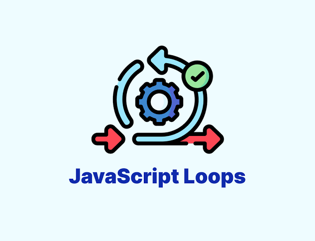
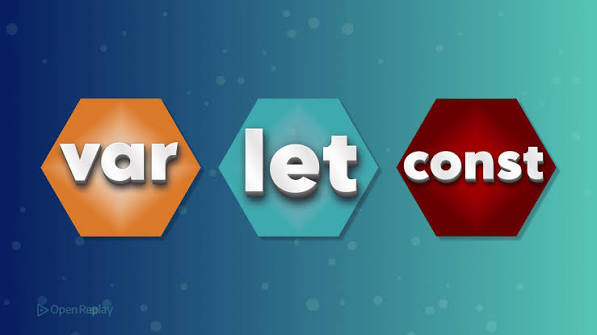
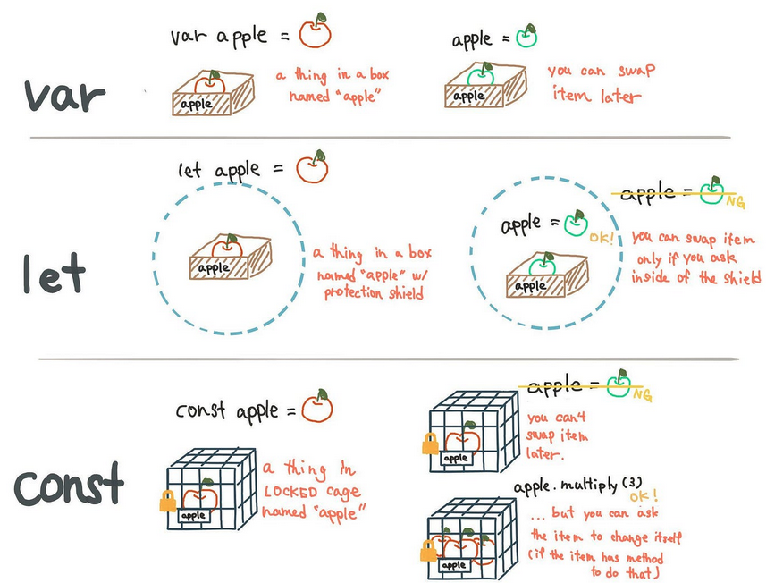
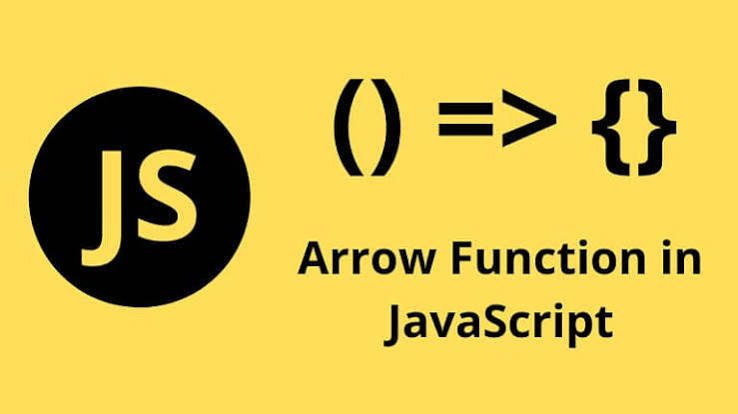

# JavaScript

## Tipos de bucles en JavaScript

<figure><figcaption></figcaption></figure>

¿Alguien recuerda el famoso castigo de las novelas de Charles Dickens donde los estudiantes tenían que escribir líneas repetidamente en una pizarra? Imaginemos que la orden "escribe esta frase 100 veces" se pudiese hacer automáticamente. Eso es exactamente lo que hacen los bucles para código.

Los bucles son como tener un asistente incansable que puede repetir tareas sin error. Ya sea que necesites revisar cada artículo en un carrito de compras o mostrar todas las fotos de un álbum, los bucles manejan la repetición de manera eficiente.

JavaScript ofrece varios tipos de bucles para elegir. Analicemos cada uno y entendamos cuándo usarlos.

Hay diferentes tipos de bucles, pero esencialmente, todos hacen lo mismo: repiten una acción varias veces. (¡Es posible que ese número sea cero!).

Los diversos mecanismos de bucle ofrecen diferentes formas de determinar los puntos de inicio y terminación del bucle. Hay varias situaciones que son mejor atendidas por un tipo de bucle que por otros.

Las declaraciones para bucles proporcionadas en JavaScript son:

1. Bucle for
2. Bucle for...in
3. Declaración for...of
4. Bucle while
5. Bucle do...while
6. Método forEach
7. Declaración break
8. Declaración continue
9. Switch-case

#### **1. Bucle For**

El bucle `for` es como poner un temporizador: sabes exactamente cuántas veces quieres que algo suceda. Es súper organizado y predecible, lo que lo hace perfecto cuando trabajas con arrays o necesitas contar cosas. &#x20;

```javascript
for (var i = 0; i < 5; i++) {
  console.log("El valor de i es: " + i);
}
```

En este ejemplo, la variable `i` se utiliza para llevar un registro del número de veces que se ha ejecutado el bloque de código dentro del `for`. La sentencia `for` inicializa `i` con un valor de 0. Mientras que `i` sea menor que 5, se ejecutará el bloque de código, mostrando en la consola el valor actual de `i` con el mensaje "El valor de i es: " y aumentando el valor de `i` en cada iteración.

#### **2. Bucle For-in**


La sentencia `for-in` se utiliza para recorrer las propiedades de un objeto.

```javascript
var persona = {
  nombre: "Ana",
  edad: 28,
  pais: "España"
};

for (var propiedad in persona) {
  console.log("La propiedad " + propiedad + " tiene el valor " + persona[propiedad]);
}
```

En este ejemplo, la variable `propiedad` se utiliza para llevar un registro del nombre de la propiedad que se está recorriendo en cada iteración. La sentencia `for-in` recorre las propiedades del objeto `persona` y, en cada iteración, muestra en la consola el nombre de la propiedad junto con su valor correspondiente, utilizando la sintaxis `persona[propiedad]`.


#### **3. Declaración for-of** <a href="#declaracion_for...of" id="declaracion_for...of"></a>

La declaración `for...of` crea un bucle que se repite sobre objetos iterables (incluidos Array, Map, Set, objetos arguments y así sucesivamente), invocando un bucle de iteración personalizado con declaraciones que se ejecutarán para el valor de cada distinta propiedad.

```javascript
for (variable of objeto)
  expresión
```

El siguiente ejemplo muestra la diferencia entre un bucle `for...of` y un bucle `for...in`. Mientras que `for...in` itera sobre los nombres de propiedad, `for...of` itera sobre los valores de propiedad:

```javascript
const arr = [3, 5, 7];
arr.foo = "hola";

for (let i in arr) {
  console.log(i); // logs "0", "1", "2", "foo"
}

for (let i of arr) {
  console.log(i); // logs 3, 5, 7
}
```

#### **4. Bucle While**

El bucle `while` es como decir "sigue haciendo esto hasta que..." - puede que no sepas exactamente cuántas veces se ejecutará, pero sabes cuándo detenerlo. En otras palabras, repite un bloque de código mientras se cumpla una condición determinada. Es perfecto para cosas como pedir entrada al usuario hasta que proporcione lo necesario, o buscar datos hasta encontrar lo que buscas.

```javascript
var contador = 0;

while (contador < 5) {
  console.log("El contador es: " + contador);
  contador++;
}
```

En este ejemplo, la variable `contador` se utiliza para llevar un registro del número de veces que se ha ejecutado el bloque de código dentro del `while`. Mientras que el valor de `contador` sea menor que 5, el bloque de código se seguirá ejecutando, mostrando en la consola el valor actual de `contador` con el mensaje "El contador es: " y aumentando el valor de `contador` en cada iteración.

**Características del bucle While:**

* **Continúa** ejecutando mientras la condición sea verdadera.
* **Requiere** manejar manualmente las variables contador.
* **Verifica** la condición antes de cada iteración.
* **Riesgo** de bucles infinitos si la condición nunca se vuelve falsa.

#### **5. Bucle do-while**

La sentencia `do-while` se utiliza para repetir un bloque de código al menos una vez y luego mientras se cumpla una condición determinada.

```javascript
var numero = 0;

do {
  console.log("El número es: " + numero);
  numero++;
} while (numero < 5);
```

En este ejemplo, la variable `numero` se utiliza para llevar un registro del número de veces que se ha ejecutado el bloque de código dentro del `do`. El bloque de código se ejecutará al menos una vez, mostrando en la consola el valor actual de `numero` con el mensaje "El número es: " y aumentando el valor de `numero` en cada iteración. La sentencia `while` evalúa si el valor de `numero` es menor que 5 y, mientras que esto sea cierto, se seguirá repitiendo el bloque de código dentro del `do`.

#### **6. Método forEach**

Considerada una forma de bucle más moderna para trabajar con colecciones:&#x20;

* **Ejecuta** una función para cada elemento del array.
* **Proporciona** tanto el valor del elemento como el índice como parámetros.
* **No puede** ser detenido anticipadamente (a diferencia de bucles tradicionales).
* **Devuelve** undefined (no crea un nuevo array).

La sintaxis básica de un bucle `forEach` en JavaScript es la siguiente:


```javascript
colección.forEach((elemento) => {
// Código a ejecutar para cada elemento de la colección
});
```


Vamos a verlo con un ejemplo simple donde se utilizamos un bucle `forEach` para iterar sobre un array de números:

```javascript
let numeros = [1, 2, 3, 4, 5];

numeros.forEach(function(numero) {
    console.log(numero);
});
```

También es posible utilizar _Arrow Functions_ (explicaremos esta función más adelante con detalle) en lugar de funciones anónimas en la sintaxis de `forEach` _(de hecho es muy habitual)_.

```javascript
array.forEach((element) => {
  // Código a ejecutar para cada elemento
});
```

El ejemplo anterior utilizando arrow functions quedaría así:

```javascript
const numeros = [1, 2, 3, 4, 5];

numeros.forEach((numero) => {
  console.log(numero);
});
```

Es importante mencionar que el método `forEach` no retorna un array nuevo. Este tiene como función principal iterar y ejecutar una función sobre cada elemento del array en Javascript.

#### **7. Break**

La instrucción _break_ en JavaScript **representa un alto completo en el bucle.** Es decir, cuando el programa se encuentra con esta palabra, interpreta que debe detener el bucle actual. Esta palabra se usa normalmente junto al condicional _if._ Entonces, podemos definir que **si una variable llega a ser determinado valor, el bucle se detiene.** **Después de leer&#x20;**_**break,**_**&#x20;el programa pasa a leer la siguiente línea de código de nuestro archivo.**


```javascript
function comprobarBreak(x) {
var i = 0;
while (i < 6) {
if (i == 3) break;
i++;
}
return i * x;
}
```


#### **8. Continue**

La instrucción _continue_ en JavaScript es menos severa que la instrucción _break._ Esta nos permite, en vez de terminar el bucle, **saltar una parte de su función.** De este modo, esa sección no será modificada por el bucle, pero este podrá seguir con la siguiente iteración. Entonces, cuando el programa se topa con un _continue,_ **este interpreta que debe ignorar lo que hay desde esta palabra hasta el final del bucle actual.** Después de ignorarlo, sigue con la siguiente iteración. Es decir, el bucle no finaliza, pero sí se modifica su función, pues ya no ejecutará la parte final de su comportamiento inicial.


```javascript
i = 0;
n = 0;
while (i < 5) {
  i++;
  if (i == 3) {
    continue;
  }
  n += i;
}
```


#### **9. Switch**

En _JavaScript_, la sentencia `switch` es una estructura de control que nos permite ejecutar diferentes bloques de código dependiendo del valor de una **expresión**. Esta estructura es útil cuando queremos realizar diferentes acciones basadas en una única variable.

**Sintaxis**

La sentencia `switch` evalúa una **expresión**, comparando el valor con los diferentes **casos** que le hemos definido. Si hay coincidencia ejecuta el bloque de código asociado. Para ello, se utiliza la sentencia `break` para separar cada caso y evitar que se sigan evaluando el resto de casos.

```javascript
switch (expresión) {
  case valor1:
    // código a ejecutar si la expresión coincide con valor1
    break

  case valor2:
    // código a ejecutar si la expresión coincide con valor2
    break
  default:
    // código a ejecutar si la expresión no coincide con ningún valor
    break
}
```

Switch-case puede considerarse tanto un condicional, como una estructura de control de flujo, es por ello que lo mencionamos en este apartado.&#x20;

* **Control de flujo:** Permite al programa tomar decisiones y cambiar su camino de ejecución según el estado de los datos, actuando como una alternativa más limpia a múltiples bloques `if...else if`.
* **Condicional:** Funciona comparando si el valor de la expresión coincide estrictamente (===) con el valor de cada `case`&#x20;

Podremos verlo con claridad en el siguiente ejemplo:&#x20;


```javascript
const mascota = "perro";
 
switch (mascota) {
  case "lagarto":
    console.log("Tengo un lagarto");
    break;
  case "perro":
    console.log("Tengo un perro");
    break;
  case "gato":
    console.log("Tengo un gato");
    break;
  case "serpiente":
    console.log("Tengo una serpiente");
    break;
  case "loro":
    console.log("Tengo un loro");
    break;
  default:
    console.log("No tengo mascota");
    break;
}
```


La siguiente tabla muestra un resumen de los bucles e instrucciones de control de flujo:&#x20;

| Tipo de bucle o instrucción       | ¿Qué hace?                                                                                                                             |
| --------------------------------- | -------------------------------------------------------------------------------------------------------------------------------------- |
| **Declaración `for`**             | Repite un bloque de código un número determinado de veces mediante una inicialización, una condición y una expresión de actualización. |
| **Declaración `for...in` \***     | Recorre las propiedades enumerables de un objeto. No se recomienda para recorrer arrays.                                               |
| **Declaración `for...of` \*\***   | Recorre los valores de objetos iterables, como arrays, strings, `Map` y `Set`.                                                         |
| **Declaración `while`**           | Ejecuta un bloque de código mientras una condición sea verdadera.                                                                      |
| **Declaración `do...while`**      | Ejecuta un bloque de código al menos una vez y continúa repitiéndolo mientras la condición sea verdadera.                              |
| **Método `forEach()`**            | Ejecuta una función una vez por cada elemento de un array. No permite utilizar `break` ni `continue`.                                  |
| **Declaración `break` \*\*\***    | Interrumpe inmediatamente la ejecución de un bucle o una instrucción `switch`.                                                         |
| **Declaración `continue` \*\*\*** | Omite la iteración actual de un bucle y continúa con la siguiente.                                                                     |
| **Declaración `labeled`**\*\*\*\* | Asigna una etiqueta a un bloque o bucle para poder controlarlo mediante `break` o `continue`.                                          |
| **Declaración `switch`**          | Ejecuta diferentes bloques de código según el valor de una expresión.                                                                  |

#### Notas

* **\*for...in** está pensado para recorrer propiedades de objetos, no elementos de arrays.
* **\*\*for...of** es la forma moderna y recomendada para recorrer arrays y otros objetos iterables.
* **\*\*\*break** y **continue** no son bucles propiamente dichos, sino instrucciones de control del flujo.
* **\*\*\*\*labeled** es una característica avanzada y de uso poco frecuente en código moderno.

### Buenas prácticas


* Utilizar el bucle más apropiado para la tarea. Los bucles `for` son útiles para iterar sobre un rango de números, mientras que los bucles `while` son útiles para iterar mientras se cumpla una condición.
* Ser consciente del número de iteraciones que se realizarán. En algunos casos, puede ser más eficiente utilizar un bucle `for` en lugar de un bucle `while`, ya que se conoce de antemano el número de iteraciones.
* Evitar bucles infinitos. Asegurarse de que la condición de finalización del bucle sea alcanzable. Si no se cumple la condición de finalización, el bucle se ejecutará indefinidamente y puede causar problemas de rendimiento o errores en la aplicación.
* Utilizar nombres descriptivos y legibles para las variables de los bucles. Esto hace que el código sea más fácil de entender y depurar.
* No modificar la variable de control dentro del bucle. Si es necesario modificar la variable de control, asegurarse de que la condición de finalización del bucle siga siendo alcanzable.
* Evitar las operaciones costosas dentro del bucle. Si es posible, realizar las operaciones costosas fuera del bucle o en una iteración separada.

Siguiendo estas buenas prácticas en los bucles en JavaScript, podemos escribir código más legible, eficiente y menos propenso a errores sutiles.

## `const`, `let` y `var` Diferencias y usos

<figure><figcaption></figcaption></figure>

Una de las características que llegaron con ES6 es la adición de `let` y `const`, que se pueden utilizar para la declaración de variables. La pregunta es, ¿qué las hace diferentes del viejo `var` que hemos venido utilizando?.

En este apartado explicaré  `var`, `let` y `const`  con respecto a su ámbito (alcance), uso y hoisting.

Antes de la llegada de ES6, las declaraciones `var` eran las que mandaban. Sin embargo, hay problemas asociados a las variables declaradas con `var`. Por eso fue necesario que surgieran nuevas formas de declarar variables. En primer lugar, vamos a entender más sobre `var` antes de discutir esos problemas.

**Hoisting**

Antes de explicar estas tres formas de declarar una variable, es necesario comprender lo que significa "hoisting" (elevar, en inglés).

Hoisting es cuando las funciones y las variables se almacenan en memoria para un contexto de ejecución antes de ejecutar nuestro código.&#x20;

Hoisting en JavaScript, nos permite acceder a funciones y variables antes de que hayan sido creadas.

El hoisting funciona de forma diferente si la declaración de la variable se realiza mediante `let` o `const`.

En el caso de `var` el valor se inicializa a indefinido (undefined) durante la fase de creación. Sin embargo, en el caso de `let` y `const` el valor sólo se inicializa durante la fase de ejecución.

<figure><figcaption><p>Declaración de variables, explicado con manzanas</p></figcaption></figure>

#### &#x20;**`var`** <a href="#mbito-de-var" id="mbito-de-var"></a>

La declaración de variables usando `var` fue la forma original de declarar variables en JavaScript, lo que lo hace compatible con todas las versiones del lenguaje. En la actualidad, ésto tiene algunas limitaciones importantes, especialmente en términos de ámbito.

El ámbito, significa esencialmente dónde están disponibles estas variables para su uso. Las declaraciones `var` tienen un ámbito global o un ámbito de función/local.

El ámbito es global cuando una variable `var` se declara fuera de una función. Esto significa que cualquier variable que se declare con `var` fuera de una función está disponible para su uso en toda la pantalla.

`var` tiene un ámbito local cuando se declara dentro de una función. Esto significa que está disponible y solo se puede acceder a ella dentro de esa función.

Para entenderlo mejor, mira el siguiente ejemplo.

```javascript
    var saludar = "hey, hola";
    
    function nuevaFuncion() {
        var hola = "hola";
    }
    console.log(hola); // error: hola is not defined
```

Esto ocurre, porque, en este ejemplo, `var` tiene un ámbito local y no está disponible fuera de la función.&#x20;

En términos de declaraciones, `var` se puede volver a declarar, pero `let` y `const` no. Entonces, cuando usa `var`, puede hacer algo como esto:

```
var greeting = "Hello";
var greeting = "Hello, hello, everyone";
```

#### **`let`** <a href="#let" id="let"></a>

`let` es ahora preferible para la declaración de variables. No es una sorpresa, ya que es una mejora de las declaraciones con `var`. También resuelve el problema con `var` que acabamos de describir.&#x20;

**Ámbito de** **`let`**

Un bloque es un trozo de código delimitado por {}. Un bloque vive entre llaves. Todo lo que está dentro de llaves es un bloque.

Así que una variable declarada en un bloque con `let`  solo está disponible para su uso dentro de ese bloque, a diferencia de lo que ocurre con `var`. Permíteme explicar esto con un ejemplo:


```javascript
   let saludar = "dice Hola";
   let tiempos = 4;

   if (tiempos > 3) {
        let hola = "dice Hola tambien";
        console.log(hola);// "dice Hola tambien"
    }
   console.log(hola) // hola is not defined

```


En otras palabras, `let` _puede modificarse pero no volver a declararse_.

Al igual que `var`,  una variable declarada con `let` puede ser actualizada dentro de su ámbito. A diferencia de `var`, una variable `let` no puede ser re-declarada dentro de su ámbito. Así que mientras esto funciona:


```javascript
    let saludar = "dice Hola";
    saludar = "dice Hola tambien";
```



#### **`Const`**

Las variables declaradas con `const` mantienen valores constantes. Las declaraciones `const` mantienen similitudes con las declaraciones `let`.

Las declaraciones `const` tienen un ámbito de bloque. Al igual que las declaraciones `let`, ya que solo se puede acceder a las declaraciones `const` dentro del bloque en el que fueron declaradas.&#x20;

Esto significa que `const` _no puede modificarse ni volver a declararse_. Tampoco se puede actualizar. Así que si declaramos una variable con `const`, no podemos hacer esto:


```javascript
const saludar = "dice Hola";
saludar = "dice Hola tambien";// error: Assignment to constant variable. 
```


Ni tampoco esto:&#x20;


```javascript
const saludar = "dice Hola";
const saludar = "dice Hola tambien";// error: Identifier 'saludar' has already been declared
```


**Buenas prácticas**

Las funciones se almacenan con una referencia a las funciones completas, las variables declaradas con `var` con el valor de `undefined`, y las variables declaradas con `let` y `const` se almacenan sin inicializar.

Las mejores prácticas sugieren declarar las variables al principio del bloque de código. También es preferible utilizar `let` y `const` para la declaración de variables. Esto mejora la legibilidad del código.

Aunque el uso de la declaración de variables mediante `var` se ha convertido en algo obsoleto, es importante conocer este concepto, ya que es posible que lo encontremos en algunas de las bases de código existentes o incluso en una entrevista donde debamos refactorizar dicho código con las últimas características de JavaScript.

## Arrow function

<figure><figcaption></figcaption></figure>

Las **funciones flecha** o **arrow functions** son uno de los aspectos más importantes que debemos aprender en JavaScript moderno. Su uso está muy extendido, y si nunca las has visto o trabajado con ellas, pueden parecer un poco intimidantes.\
Su aspecto es completamente diferente al de cualquier otro tipo de declaración de función que hayamos visto si solo has usado JavaScript puro, en versiones antiguas.

Utiliza la sintáxis **=>** para definir las funciones de una manera más compacta y fácil de interpretar.

Es importante subrayar que las **arrow function son anónimas**, lo que significa que no tienen nombre.

Este anonimato crea algunos problemas:

1. Más difíciles de depurar

Cuando obtengas un error, no serás capaz de rastrear el nombre de la función o el número de línea exacto donde ocurrió.

2\.  Sin autorreferencia

Si tu función necesita tener autorreferencia en algún punto (por ejemplo, recursión, controlador de evento que necesita desvincularse), no funcionará.

Estructura:


```javascript
const nombreFuncion = (parametros) => {
 // cuerpo de la función
 return valor;
};
```


Tipos de **arrow function** en diferentes ámbitos:

1\. **Función sin parámetros**


```javascript
const sayHello = () => {
 return 'Hello!';
};
console.log(sayHello()); // 'Hello!'
```


2\. **Función con un solo parámetro**

Si hay un solo parámetro, se pueden omitir los paréntesis:


```javascript
const square = x => {
 return x * x;
};
console.log(square(4)); // 16 
```


3\. **Función con múltiples parámetros**


```javascript
const add = (a, b) => {
 return a + b;
};
console.log(add(3, 5)); // 8
```


4\. **Función con cuerpo conciso**

Si el cuerpo de la función contiene una sola expresión, se pueden omitir las llaves y el return:


```javascript
const multiply = (a, b) => a * b;
console.log(multiply(2, 3)); // 6
```


**Características de las funciones de flecha:**

* _**Sintaxis más concisa**_: Las funciones de flecha permiten escribir funciones de forma más breve.
* _**No tienen su propio this**_: El valor de this dentro de una función de flecha es el mismo que el valor de this en el entorno donde se definió la función (contexto léxico).

**Diferencias con las funciones tradicionales**:

* _**Contexto this**_: En funciones tradicionales, el valor de this puede cambiar dependiendo de cómo se invoque la función. Como se ha indicado en líneas anteriores, en funciones de flecha, this está ligado al contexto en el que se definió la función.


```javascript
function TraditionalFunction() {
 this.value = 1;
 setTimeout(function() {
 this.value++;
 console.log(this.value); // undefined (o error en modo estricto)
 }, 1000);
}
function ArrowFunction() {
 this.value = 1;
 setTimeout(() => {
 this.value++;
 console.log(this.value); // 2
 }, 1000);
}
new TraditionalFunction();
new ArrowFunction();
```


&#x20;

* **No pueden ser usadas como constructores**: Las funciones de flecha no pueden ser usadas con new para crear instancias. Intentar hacerlo resultará en un error.
* **No tienen acceso a argumentos**: Las funciones de flecha no tienen su propio objeto-argumento. Para acceder a los argumentos, se debe usar el operador rest (...args).

Ejemplo:


```javascript
// Función tradicional
function Person() {
 this.age = 0;
 setInterval(function() {
 this.age++;
 console.log(this.age); // En una función tradicional, `this` no es lo que se espera
 }, 1000);
}
new Person(); // El valor de `this` no se refiere a la instancia de Person
// Función de flecha
function Person() {
 this.age = 0;
 setInterval(() => {
 this.age++; // En una función de flecha, `this` se refiere al contexto léxico
 console.log(this.age);
 }, 1000);
}
new Person(); // El valor de `this` es correcto y se refiere a la insta
```


## Deconstrucción de variables

La clave está en la sintaxis. La asignación se encierra en corchetes a ambos lados del igual, como en el ejemplo.&#x20;


## Operador de extensión en JS

## Programación orientada a objetos con JS

Hasta hace unos años, JavaScript NO era un lenguaje orientado a objetos, por tanto no tenía clases, y como cada función en JavaScript es un objeto y los objetos pueden tener atributos, los desarrolladores comenzaron a agregar atributos a las funciones como si fueran objetos normales, lo que les permitió tratarlas como una clase.

JavaScript es un lenguaje con muchas excepciones, por ello es difícil de aprender para muchas personas, pero si entendemos que prácticamente todo en JavaScript es un objeto al que podemos añadir atributos, funciones y demás, entonces es mucho más sencillo entender cómo funciona.

## Qué es una promesa en JavaScript

## Async y await

